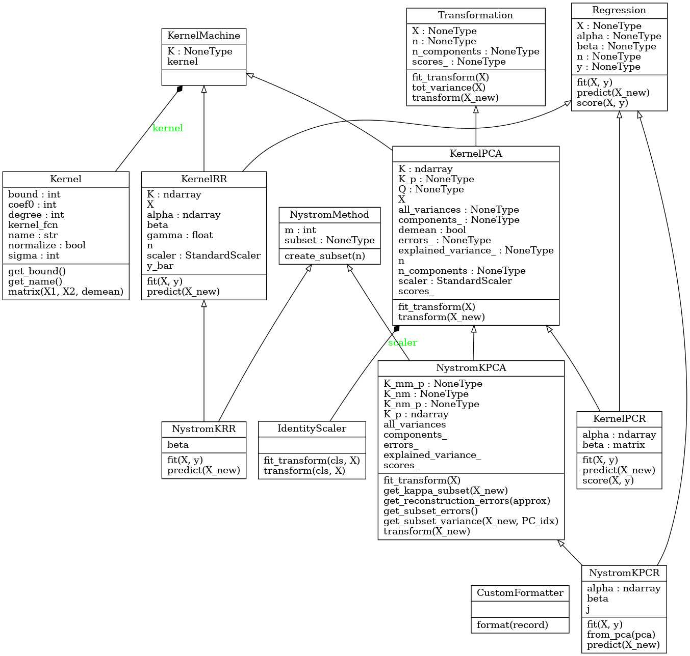

# Kernel PCA with the Nyström method :bar_chart: :microscope: :triangular_ruler:

  

This package implements an _efficient non-linear PCA_ by combining kernel PCA with the Nyström randomized subsampling method and calculates a confidence interval to measure its accuracy. The method is also applied to the regression problem to create Nyström principal component regression.

For further details please see my paper: https://arxiv.org/abs/2109.05578.

#### Table of Contents

1. [Install](#cd-install)
2. [Code structure](#file_folder-package-structure)
3. [Run](#blue_car-run)
4. [Experiments](#telescope-experiments)
5. [Documentation](#notebook-documentation)
6. [Tests](#hammer-tests)
7. [Citation](#memo-citation)


## :cd: Install

For Linux/MacOS open the terminal and do

```
$ pip3 install nystrompca
```

where `$` is the command-line prompt. On Windows use `pip` instead of `pip3`.


#### Requirements

* Python 3.6 or above
* Numpy 1.9 or above
* Pandas 0.20 or above
* Scikit-learn 0.19 or above
* Matplotlib 2.0 or above
* Seaborn 0.8 or above


## :file_folder: Code structure

The package structure is as follows

```
nystrompca/
	experiments/
		methods_experiments.py
		bound_experiments.py
		regression_experiments.py
		plotting.py
		data.py
		console_script.py
		base_parser.py
	algorithms/
		nystrom_KPCA.py
		nystrom_KPCR.py
		nystrom_KRR.py
		kernel_PCA.py
		kernel_PCR.py
		kernel_RR.py
		bound.py
	base/
		kernel.py
		kernel_machine.py
		regression.py
		transformation.py
		nystrom_method.py
	utils/
		utils.py
		logger.py
```

The raw datasets used in the experiments are included in the folder `data/`. PCA and PCR examples in Jupyter notebooks are located in the `notebook_examples/` folder.

The algorithms are implemented as objects with methods to fit and apply them, with an API like `scikit-learn`. The inheritance relationships among the algorithm classes and base classes are illustrated by the following UML diagram




## :blue_car: Run

#### Calculate Nyström kernel PCA

```python
import numpy as np

from nystrompca import NystromKPCA

X = np.random.randn(1000, 100)

nystrom_kpca = NystromKPCA(n_components=5, m_subset=10, kernel='rbf')
X_kpca       = nystrom_kpca.fit_transform(X) # Returns the principal scores

print(nystrom_kpca.explained_variance_) # Principal values

# Reconstruction error of full dataset onto the Nyström PCs
# Beware this is O(n^2), unless 'approx=True'
errors = nystrom_kpca.get_reconstruction_errors()
```


#### Calculate Nyström kernel PCR

You can use the built-in method

```python
from nystrompca import NystromKPCR

X      = np.random.randn(1000, 100)
y      = np.random.randn(1000, 1)
x_test = np.random.randn(1, 100)

nystrom_kpcr = NystromKPCR(n_components=5, m_subset=10, kernel='rbf')
nystrom_kpcr.fit(X, y)
prediction = nystrom_kpcr.predict(x_test)
```

or simply do a linear regression directly on the principal scores as follows.
Or indeed use any other supervised learning method!

```python
from sklearn.linear_model import LinearRegression

nystrom_kpca = NystromKPCA(n_components=5, m_subset=10, kernel='rbf')
X_kpca       = nystrom_kpca.fit_transform(X)

linear_regression = LinearRegression()
linear_regression.fit(X_kpca, y)
x_test_kpca = nystrom_kpca.transform(x_test)
prediction  = linear_regression.predict(x_test_kpca)
```


#### Calculate the confidence bound

To calculate the bound just import and call the function `calculate_bound`. The function calculates the bound for all PCA dimensions.

```python
from nystrompca import calculate_bound

X = np.random.randn(100, 10)

bounds = calculate_bound(X, n=1000, kernel='rbf')
```

## :telescope: Experiments

To run the experiments use the built-in command-line tool `nystrompca` with argument `methods`, `bound` or `regression` depending on which experiments to run.

```
$ nystrompca -h

usage: nystrompca [-h] {methods,bound,regression} ...

Run the different Nyström kernel PCA experiments.

optional arguments:
  -h, --help            show this help message and exit

available subcommands:
  {methods,bound,regression}
                        which experiment to run

Display subcommand options with nystrompca <subcommand> -h

```

You can run the experiments for example with different kernels and different values for the total data size *n*, the size of the Nyström subset *m*, and the number of PCA dimensions *d* by passing addtional arguments.

For example, to run the bound experiments for a data size of 100, a Nyström subset of size 20, a maximum PCA dimension of 10, and the Laplace kernel you would do

```
$ nystrompca bound -n 100 -m 20 -d 10 --kernel laplace
```


## :notebook: Documentation

The package uses [Numpy-style docstrings](https://numpydoc.readthedocs.io/en/latest/format.html). It can be generated into HTML with Sphinx through (requires the `sphinx`, `numpydoc` and `sphinx_rtd_theme` packages)

```bash
make html
```
The generated documentation is located in `docs/build/html`.


## :hammer: Tests

The package contains unit tests to test the code functionality and integration tests to check that the algorithms behave as expected. The code has type annotations to enable static type checks.


#### Unit and integration tests

The unit tests and integration tests are located in the folder `test/` and can be run with `pytest` or `nose`, e.g. on Linux/MacOS do

```bash
$ pytest test/
```
or
```bash
$ nosetests3 test/**
```

Running the tests with `pytest` should produce an output similar to the following

```
================================ test session starts =================================
platform linux -- Python 3.8.10, pytest-6.2.2, py-1.10.0, pluggy-0.13.1
rootdir: /home/fred/nystrompca, configfile: pytest.ini
collected 50 items                                                                   

test/algorithms/test_bound.py ....                                             [  8%]
test/algorithms/test_kernel_PCA.py ...                                         [ 14%]
test/algorithms/test_kernel_PCR.py .                                           [ 16%]
test/algorithms/test_nystrom_KPCA.py ...                                       [ 22%]
test/base/test_kernel.py .....                                                 [ 32%]
test/base/test_nystrom_method.py ...                                           [ 38%]
test/integration/test_e2e.py ..                                                [ 42%]
test/integration/test_integration.py ..................                        [ 78%]
test/utils/test_logger.py .                                                    [ 80%]
test/utils/test_utils.py ..........                                            [100%]

================================ 50 passed in 15.60s =================================
```

#### Test coverage

To calculate and display test coverage first install the `coverage` Python package and then run from the root folder
```
$ coverage run -m pytest test
$ coverage report
```
This should produce the following output
```
Name                                    Stmts   Miss  Cover
-----------------------------------------------------------
nystrompca/algorithms/bound.py             30      0   100%
nystrompca/algorithms/kernel_PCA.py        53      1    98%
nystrompca/algorithms/kernel_PCR.py        29      1    97%
nystrompca/algorithms/kernel_RR.py         28     18    36%
nystrompca/algorithms/nystrom_KPCA.py     128     12    91%
nystrompca/algorithms/nystrom_KPCR.py      23      3    87%
nystrompca/algorithms/nystrom_KRR.py       23     14    39%
nystrompca/base/kernel.py                  70      3    96%
nystrompca/base/kernel_machine.py           9      0   100%
nystrompca/base/nystrom_method.py          12      0   100%
nystrompca/base/regression.py              25      2    92%
nystrompca/base/transformation.py          23      8    65%
nystrompca/utils/logger.py                 32      4    88%
nystrompca/utils/utils.py                  55      0   100%
-----------------------------------------------------------
TOTAL                                     540     66    88%
```


#### Static checks

To run static checks including type checks you can e.g install `mypy` and do from the root folder

```bash
$ mypy nystrompca/
```

This should produce the following output

```
Success: no issues found in 26 source files
```


#### Linting

Coding style has been checked with `pylint`. You can run from the root folder

```
$ pylint nystrompca/
```

This should produce the following output
```
------------------------------------
Your code has been rated at 10.00/10
```

Certain style rules are being ignored to adapt to the specific coding style of the package (please see `.pylintrc`).


## :memo: Citation

If you found this package interesting then please consider citing the paper, for example using the following with bibtex
```
@article{hallgren2021kernel,
  title={Kernel {PCA} with the {N}ystr{\"o}m method},
  author={Hallgren, Fredrik},
  journal={arXiv preprint arXiv:2109.05578},
  year={2021}
}
```

